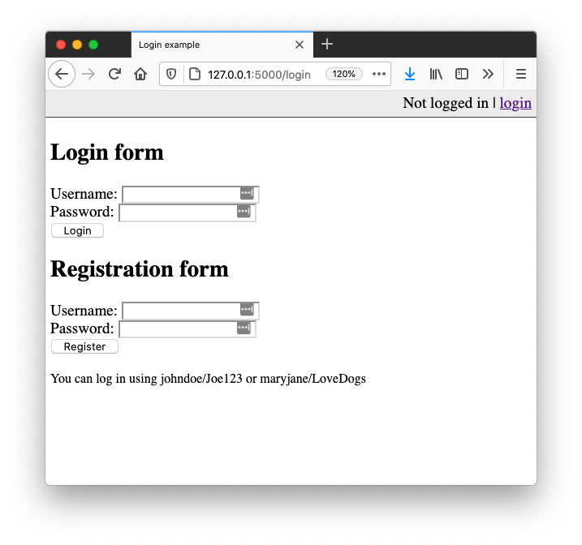
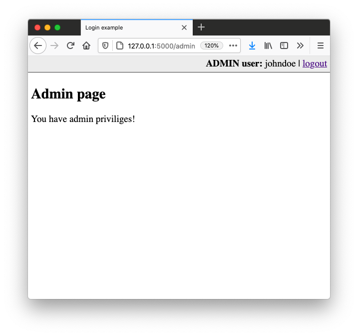

# Login with (Python, Flask), Part V.

## Exercise #1: Create database

File [exercise1.py](exercise1.py) contains the bases for a file with database operations. 

* Run the file to create a table storing user details.
* Finish the functions to add and retrieve user details.

## Exercise #2: Login and signup

Update the [login example](../../examples/9_login/) to use the database you created.
Further extend the example to allow signup. 

## Exercise #3: Authentication

Extend your application with user roles, e.g. `admin` and `user`.
You need to:
* Extend the user table to contain a user `role`
* Extend the login and logout, to store/remove the current user role in the session
* Create an additional route, e.g. `/admin` that is only accessible to admin users.
* If a non admin user accesses this route (e.g. typing it into the address field) the server should return a 403 error.

