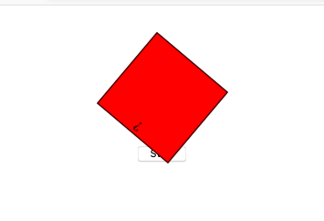

# Async JS exercises

## Exercise 0: Countdown timer

  - Make a countdown timer that counts back from the selected time. Check the starting files ([exercise0.html](exercise0.html) and [exercise0.js](exercise0.js)) which already provide you with a select list and code for processing the user input.
  - Show in large text the remaining time in MM:SS format and update the counter with each second elapsed. You can use the `getSecondDisplay` function.
  - In addition, show the remaining time in a progress bar. Set `max` and `value` attributes, and reset `value` every second.
    * Use the [HTML5 progress element](https://www.w3schools.com/tags/tag_progress.asp) (but remember to progress "backwards").
  - Display an alert when the time is up.

  - Can you use your timer several times? If not, why?

## Exercise #1: Rotate forever

[exercise1.html](exercise1.html) contains a red box and a start button.
When the start button is clicked, the red box should start rotating and never stop.
Use the provided sleep function to implement start.
Try the following:
* Add class `around`
* `sleep` 3 seconds
* remove class `around`
* `sleep` 10ms
* repeat the above steps forever you can use a `while` loop.

## Exercise #2: Stop rotating

Add a **stop** button to the solution from Exercise #1.
When clicked the box should stop rotating.
Can you make the box stop immediately, not after it finished a round?

*Hint: Raise an error by rejecting the promise to stop.*